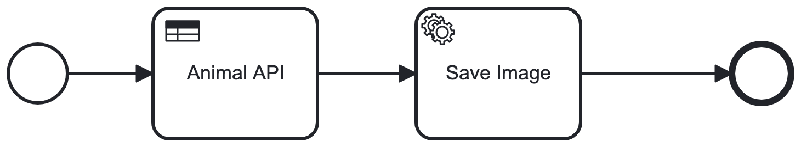

# Animal Image Selector Process

*Process solution for selection and preview of random animal image based on user's selection

## Assumptions and Decisions
* The cat API was not available and hence I replaced it with hardcoded url of cat image.
* I am using jdk17 for my development environment and since `spring-zeebe-test` is not compatible with jdk17, 
was not able to run the process integration test. I tried to use `spring-zeebe-test-testcontainer`, 
but I ran into other dependency issues which am not able to solve. Instead I have written a mockito verification unit test.  

This following stack is used:

* Camunda Platform 8
* Java 17
* Spring Boot 3
* In memory H2 database

# Intro

The process model contains two tasks:

* A DMN to choose the API based on user's selection
* A service task which retrieves a image from API and saves to a repository

The process solution is a Maven project and contains:

* The Animal Image Selector process model as BPMN
* Source code to provide a REST endpoint for clients
* Java Job worker to do the retrieve Image and save to in memory H2 DB
* A simple html page with JQuery to capture Category selection (eg:- Dog , Cat or Bear)
* On Process completion, the Image is retrieved from the repository and rendered in UI

## Create Camunda Platform 8 Cluster

Create a Cluster on Camunda Cloud. Create the client and update the credentials and server details in the below file
* Copy the client credentials into `src/main/resources/application.properties`

## Run Spring Boot Java Application locally

`mvn package spring-boot:run`

## Play

You can easily use the application by selecting a category from UI

Navigate to http://localhost:8080 from User Interface

You can now see the process instance in Camunda Operate - linked via the Cloud Console.

## Deploying locally to docker

Execute following to deploy the app to Docker

`docker build . -t animal-image-selector-1.0.0-snapshot`

`docker run -d -p 8080:8080 animal-image-selector-1.0.0-snapshot`

##Helm commands

I am using docker desktop environment for kubernetes. And Instead of packaging the helm charts, just running from the folder. 

`helm install animal-image-selector animal-image-selector/.` 